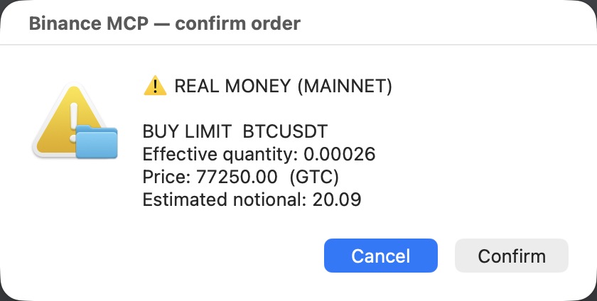
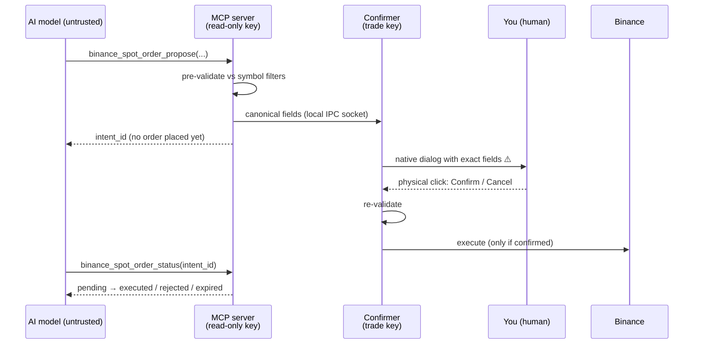

# kainext-binance-mcp

[](https://github.com/Alejandrehl/kainext-binance-mcp/actions/workflows/ci.yml)
[](LICENSE)
[](https://www.python.org/)
[](https://modelcontextprotocol.io/)
[](https://pypi.org/project/kainext-binance-mcp/)
[](https://pypi.org/project/kainext-binance-mcp/)
[](pyproject.toml)

> **Let an AI assistant read Binance markets, analyze them, and *propose* real-money
> trades — while a separate, human-gated process is the only thing that can ever execute.
> The model never holds a trade key, and nothing moves without a physical click.**

<p align="center">
  
  <br>
  <em>The gate. Every order renders exactly what will execute — and the default button is Cancel.</em>
</p>

`kainext-binance-mcp` is a [Model Context Protocol](https://modelcontextprotocol.io/) server
that connects any MCP client (Claude Code, Claude Desktop, …) to a Binance account.
It exposes **25 tools**, **5 analyst prompts** and **8 knowledge resources** spanning live
market data, technical indicators, news & sentiment, derivatives positioning, market
structure, portfolio/risk analytics, transparent trading signals, and **two-phase order
execution with a human in the loop** — a complete, honest crypto analysis consultant in
one install. It also ships an **offline USD-M futures research engine** (no tools, no keys,
no network at import time) — see [Futures research](#futures-research).

It is built around one uncompromising idea: **treat the language model as untrusted.** Even a
fully prompt-injected or malfunctioning model cannot move your funds, because it has neither
the credential nor the authority to do so. See [SECURITY.md](SECURITY.md) for the full threat
model.

> ⚠️ **Real money.** On `mainnet`, every order moves actual funds. **Always start on
> [testnet](#testnet-first-recommended)** and switch to mainnet only once everything is
> verified.
> ✅ **Execution works on every OS** (v1.2): native dialog on macOS, a local web
> confirmation page elsewhere, or a TTY prompt for headless boxes — see
> [Confirmation backends](#confirmation-backends).

---

## Why this exists

LLM agents are great at *reasoning about* markets and terrible at being *trusted with*
irreversible, money-moving actions. Most "AI trading" tooling hands the model an API key and
hopes for the best. This project takes the opposite stance: the AI gets rich, read-only
context and a way to **propose** an action, but a **human holds the trigger** and a
**separate process holds the key**. You get the upside of an AI co-pilot for your trading
without surrendering custody or control.

## Security model — the headline feature

Two processes, least privilege, human-in-the-loop:

| Process | Launched by | Key | Role |
|---|---|---|---|
| **MCP server** `kainext-binance-mcp` | your MCP client (stdio) | **read-only** (`BINANCE_READ_*`) | reads, pre-validates, and **proposes** orders. **Never executes, holds no trade key.** |
| **Confirmer** `kainext-binance-mcp-confirmer` | **you**, in a separate terminal | **trade** (`BINANCE_TRADE_*`) | the **sole authority**: receives canonical fields, renders the dialog, re-validates, and **executes only on your click**. |

Releases are published to PyPI via **trusted publishing** and carry **Sigstore digital
attestations** (verify any file at `pypi.org/integrity/`): what you install is provably
what this repository's release workflow built.



To execute one order you need **both** the trade key (isolated in the confirmer) **and** your
physical click. The model has neither. Defense in depth on top of that:

- On **mainnet**, the server aborts at startup if its read key can trade.
- The confirmer aborts at startup if the trade key has withdrawals/transfer/margin/futures
  permissions or no IP whitelist.
- Withdrawals and transfers are **permanently out of scope** — no key enables them.
- **Single-tenant:** one server+confirmer pair serves exactly one account; run separate pairs
  for separate accounts.

---

## Tools (25)

### Read (5 · read key · no gate)

| Tool | What it does | Params |
|---|---|---|
| `binance_get_balance` | Spot balances (free/locked), non-zero only | — |
| `binance_get_price` | Current price/ticker for a symbol | `symbol` |
| `binance_get_open_orders` | Open spot orders + status | `symbol?` |
| `binance_get_order_history` | Closed spot order history | `symbol`, `limit?` |
| `binance_get_account_info` | Flags + fees; key permissions (mainnet) | — |

### Market data — layer 2 (4 · read key · 100% read-only)

| Tool | What it does | Params |
|---|---|---|
| `binance_get_klines` | OHLCV candles (Decimal). `last_n` returns only the newest N to keep responses small | `symbol`, `interval`, `limit?` (≤1000), `last_n?` |
| `binance_get_ticker_24h` | Rolling 24h stats (% change, high/low, volume) | `symbol` |
| `binance_compute_indicators` | RSI / MACD / EMA / Bollinger / ATR. Returns only the latest value per series by default (`last_n=1`) to keep responses small; raise `last_n` for recent history | `symbol`, `interval`, `indicators`, `limit?`, `last_n?` |
| `binance_backtest` | Lightweight, no-lookahead backtest of a simple rule | `symbol`, `interval`, `strategy` (`ema_cross`/`rsi_threshold`), `limit?` |

### News & sentiment — layer 3 (2 · public RSS · no API key · 100% read-only)

| Tool | What it does | Params |
|---|---|---|
| `binance_get_news` | Crypto headlines from RSS (CoinDesk, crypto.news) | `asset?`, `sources?`, `limit?` |
| `binance_get_sentiment` | Aggregated **raw** sentiment (lexicon, not a prediction) | `asset`, `window_hours?` |

### Signals — layer 4 (3 · read key · *propose*, never execute)

| Tool | What it does | Params |
|---|---|---|
| `binance_generate_signal` | Composite, transparent signal: direction + score + per-factor rationale + ATR risk levels | `symbol`, `interval?`, `threshold?` |
| `binance_scan_signals` | Signals for a watchlist, ranked by score | `symbols`, `interval?` |
| `binance_backtest_signal` | Backtest the composite technical signal (no lookahead, sentiment=0) | `symbol`, `interval?`, `limit?`, `threshold?` |

### Analyst — layers 5/6 (7 · read key + free public APIs · 100% read-only)

| Tool | What it does | Params |
|---|---|---|
| `binance_get_derivatives` | Funding rate (+ short history), mark/index price, open interest — the leverage thermometer. Public futures endpoints, no extra permissions | `symbol`, `funding_limit?` |
| `binance_get_market_structure` | Fear & Greed (+week), BTC dominance, total mcap, BTC ATH/drawdown, on-chain fees & hashrate. Free sources, per-source degradation | — |
| `binance_analyze_cycle` | Mayer Multiple (price/200d MA), drawdown from ATH, distance to next halving — objective cycle inputs | `symbol?` |
| `binance_analyze_portfolio` | Live balances valued, concentration, per-asset PNL and **net break-even** (taxes + spread) — cost basis is always a user parameter | `cost_basis?`, `tax_rate?`, `cashout_spread?` |
| `binance_assess_risk` | Realized vol (30/90d), max drawdown, BTC correlation per held asset | `symbols?` |
| `binance_backtest_dca` | Backtests a mechanical DCA plan on real history — invested, PNL, honest lump-sum comparison, max drawdown | `symbol`, `monthly_quote`, `months`, `day_of_month?`, `fee?` |
| `binance_backtest_harvest` | Backtests a pre-committed harvest grid (one fire per level, upward daily-close crossings) vs pure hold | `symbol`, `initial_qty`, `grid`, `start?` |

### Write — two-phase (4 · **execution is spot-only** · the server never executes)

| Tool | What it does | Params |
|---|---|---|
| `binance_spot_order_propose` | Proposes an order; **does not execute**. Returns `intent_id` | `symbol`, `side`, `type`, `env`, `quantity?`, `quote_quantity?`, `price?`, `time_in_force?` |
| `binance_spot_order_status` | Polls the outcome of a proposal | `intent_id` |
| `binance_cancel_order_propose` | Proposes a cancellation (re-checks state); **does not cancel** | `symbol`, `order_id`, `env` |
| `binance_cancel_order_status` | Polls the outcome of a cancellation | `intent_id` |

The read, market-data, news, and signal tools work without the confirmer. The `*_propose`
tools require the confirmer to be running.

---

## The knowledge layer — what makes it a consultant

Tools fetch data; **knowledge tells the model how to think about it.** The server ships
its methodology through the two MCP surfaces most servers ignore:

**Resources** (`kb://…`) — read them from any MCP client:

| Resource | What it teaches |
|---|---|
| `kb://discipline` | The operating doctrine in two regimes that never mix: rules 1-6 govern the long-term spot portfolio (DCA > timing, position sizing, no leverage); rule 7 governs systematic research, where leverage is admissible only after clearing every condition |
| `kb://research/no-edge` | Our own walk-forward research: 0/36 configurations with a robust edge — why signals are context, not alpha |
| `kb://sources` | Curated source registry **with each source's bias annotated**, including where to read ETF flows |
| `kb://frameworks/news-analysis` | Separating signal from noise: primary vs derivative, flows/rules/structure |
| `kb://frameworks/cycle-analysis` | Halving cycles, Mayer Multiple, drawdown bands — with explicit uncertainty |
| `kb://frameworks/token-value` | The five questions that decide whether a token captures its project's value |
| `kb://macro-calendar` | FOMC / CPI / halving dates (static, versioned, with sources) |
| `kb://glossary` | Terms with an interpretive reading, not just definitions |

**Prompts** — complete playbooks that orchestrate the tools (in Claude Code they appear
as slash commands): `portfolio_review`, `asset_thesis`, `market_briefing`, `risk_check`,
`dca_plan`. Every playbook grounds itself in `kb://discipline` first, and the server's
instructions tell clients to read the doctrine before giving any investment analysis.

## Futures research

An **offline USD-M futures research engine** lives in `kainext_binance_mcp.futures`, behind
the `[research]` extra. It is deliberately **not** an MCP surface:

- **No tools, no prompts, no resources.** Nothing about it reaches the model.
- **Keyless.** It reads Binance's public archives (`data.binance.vision`) with no API key at
  all — strictly less exposed than the signed spot path.
- **Never imported by the server.** Install without `[research]` and the server starts fine.
- **Execution stays spot-only.** This engine researches; it cannot place an order.

What it does today: builds a survivorship-bias-free panel of USD-M perpetuals from the
public archives — **986 symbols, of which 306 USDT perps are already delisted** — with
point-in-time universe membership derived from the data itself. Three archive traps are
handled explicitly and documented in `futures/data.py`: the CSV header changed between eras
(2020 files have none), the current month is missing from the monthly archives, and today's
candle is incomplete, which is lookahead in disguise.

The doctrine that governs it is `kb://discipline` rule 7 — leverage is admissible only
inside a systematic strategy that has cleared every condition. See
[`ROADMAP.md`](ROADMAP.md) and [`docs/architecture.md`](docs/architecture.md).

## Quickstart

**Prerequisites:** Python 3.12+ and [uv](https://docs.astral.sh/uv/). Execution works on every OS — see [Confirmation backends](#confirmation-backends).

### 1. Create the API key(s) on Binance

Go to Binance → **API Management**. The design uses two keys for least privilege:

1. **Read-only** (used by the server): `Enable Reading` **ON**; everything else **OFF**.
2. **Trade** (used by the confirmer): `Enable Spot & Margin Trading` **ON**; withdrawals,
   universal/internal transfer, margin, futures **OFF**; **IP whitelist mandatory**. The
   confirmer aborts on mainnet if any dangerous permission is on or the IP restriction is off.

> On **testnet** ([testnet.binance.vision](https://testnet.binance.vision)), a single key
> serves both roles — there are no granular permissions or IP whitelist there.

### 2. Set environment variables

| Variable | Process | Where it goes |
|---|---|---|
| `BINANCE_ENV` | both | `testnet` or `mainnet` (no default → aborts if missing/invalid) |
| `BINANCE_READ_API_KEY` / `BINANCE_READ_API_SECRET` | server | `.mcp.json` (via `${VAR}`) or the server's shell |
| `BINANCE_TRADE_API_KEY` / `BINANCE_TRADE_API_SECRET` | confirmer | **only** the shell where you launch the confirmer |

> 🔒 **Hard rule:** the **trade key never goes in `.mcp.json`** or any environment your AI
> client inherits. It lives only in the confirmer's shell.

### 3. Add the server to your MCP client

`.mcp.json` (Claude Code style). Only the read key + `BINANCE_ENV`:

```json
{
  "mcpServers": {
    "binance": {
      "command": "uvx",
      "args": ["kainext-binance-mcp"],
      "env": {
        "BINANCE_ENV": "${BINANCE_ENV}",
        "BINANCE_READ_API_KEY": "${BINANCE_READ_API_KEY}",
        "BINANCE_READ_API_SECRET": "${BINANCE_READ_API_SECRET}"
      }
    }
  }
}
```

`${VAR}` placeholders are resolved from your shell. If a variable arrives unexpanded, the
server aborts with a clear message — export the variables before launching your client.

Installing from git instead of PyPI? Use `"args": ["--from",
"git+https://github.com/Alejandrehl/kainext-binance-mcp@v1.2.1", "kainext-binance-mcp"]`
(pin a tag; `git+https` works without any GitHub credentials).

### 4. Run the confirmer (required to execute)

In a separate terminal, with the **trade** key exported:

```bash
export BINANCE_ENV=testnet
export BINANCE_TRADE_API_KEY="...your trade key..."
export BINANCE_TRADE_API_SECRET="...your trade secret..."

uvx kainext-binance-mcp-confirmer  # or: uvx --from "git+https://github.com/Alejandrehl/kainext-binance-mcp@v1.2.1" kainext-binance-mcp-confirmer
```

It listens on a local Unix socket. When the AI proposes an order, a **native dialog** appears
with the exact fields (symbol, side, type, effective quantity, price, `timeInForce`, estimated
notional, and a `TESTNET` / `⚠️ REAL MONEY` banner). The default button is **Cancel**; the
order executes only when you click **Confirm**.

### Confirmation backends

The confirmer decides how the human approves, via `BINANCE_CONFIRM_MODE`:

| Mode | What happens | Platform |
|---|---|---|
| `auto` *(default)* | native dialog on macOS, web page elsewhere | all |
| `macos` | the native dialog (screenshot above) | macOS |
| `web` | an ephemeral page on `127.0.0.1` (one-shot token, POST-only answers, Host-validated, Cancel focused) opens in your browser | all |
| `tty` | type `CONFIRM` in the confirmer's terminal | POSIX |

Every backend keeps the same invariants: the text is rendered from the exact canonical
order that will execute, the default is deny, and a 45s timeout denies.

### Watch mode — get notified, never auto-trade

`kainext-binance-mcp-watch` is a third process that holds **no keys at all** (public
endpoints only) and can execute nothing. It checks your triggers on an interval and
notifies (desktop notification + optional webhook) on threshold **crossings** — price,
daily close (completed candles only), funding rate, Fear & Greed:

```bash
mkdir -p ~/.config/kainext-binance-mcp
cp examples/watch.example.toml ~/.config/kainext-binance-mcp/watch.toml  # edit it
kainext-binance-mcp-watch
```

### Testnet-first (recommended)

1. Generate keys at [testnet.binance.vision](https://testnet.binance.vision) (login with
   GitHub → *Generate HMAC_SHA256 Key*) and request faucet funds.
2. Export `BINANCE_ENV=testnet` and the testnet keys.
3. Exercise the full flow with fake money before touching mainnet.

## Mainnet = real money

On `mainnet`, the confirmer re-validates against live symbol filters, shows the
`⚠️ REAL MONEY` banner, and waits for your click. Start with minimal order sizes. Execution
uses the native dialog on macOS; on other platforms set `BINANCE_CONFIRM_MODE=web` (or `tty`).

---

## Development

Requires Python 3.12+ and `uv`. See [CONTRIBUTING.md](CONTRIBUTING.md) for details.

```bash
uv venv --python 3.12
uv pip install -e ".[dev,research]"       # `research` is what CI installs

uv run ruff check src/ tests/ examples/   # lint (the release gate)
uv run mypy                               # strict type checking
uv run pytest -q                          # coverage >= 90% AND zero warnings
```

Without the `research` extra `numpy` is missing, `futures/` will not import, and your local
run silently diverges from CI.

The unit suite runs fully offline. Integration tests (`-m integration`) hit Binance testnet
and skip cleanly without keys; the news test hits live RSS only with `RUN_NETWORK_TESTS=1`,
and `tests/integration/test_mcp_protocol.py` speaks the real MCP handshake over stdio.

Two gates surprise people. **`tests/test_consistency.py`** fails the build when the docs stop
describing the product — version lockstep, tool counts (total *and* per section), and the
declared scope. **`filterwarnings = ["error"]`** means any new warning is a build failure;
the existing ignores name their upstream cause.
CI runs lint + types + tests on ubuntu **and** macOS (the confirmer's target OS) across
Python 3.12/3.13, plus `pip-audit` and CodeQL, on every push and PR. `pre-commit install`
gets you the same ruff check locally.

## Roadmap

See [`ROADMAP.md`](ROADMAP.md) for the full three-phase programme and its measured state.

- ~~Migrate to MCP SDK 2.x~~ — **done**, `mcp[cli]==2.0.0`.
- ~~Exchange surfaces beyond spot~~ — **futures research shipped** (read-only, offline).
  Futures *execution* is deliberately out of scope: see [`SECURITY.md`](SECURITY.md).
- Optional notification channels for proposal/execution events.

## Research: is there an edge?

We backtested our own composite signal the hard way — **out-of-sample walk-forward over
~51,000 real candles** (4 pairs x 3 timeframes x 3 strategies, grid search on train windows,
measured on unseen test windows, triple anti-lookahead). Result: **0 of 36 configurations
showed a robust out-of-sample edge**; in-sample "edges" were overfitting.

That is why every signal tool ships with a disclaimer: the signals are **context, not alpha**.
Full write-ups and reproducible scripts: [`docs/research/`](docs/research/) + [`examples/`](examples/).

The futures engine holds itself to the same bar, plus corrections for multiple testing
(Deflated Sharpe Ratio, probability of backtest overfitting) — because the more
configurations you try, the more certain you are to find beautiful noise.

## Disclaimer

This software is **not financial advice** and comes with **no warranty** (MIT). Trading
cryptocurrencies can result in the **loss of your entire capital**. Signals, indicators, and
backtests are informational; past performance does not predict future results. You are solely
responsible for every order you confirm — that is exactly why the human gate exists.

## Author

Built by **[Alejandro Exequiel Hernández Lara](https://github.com/Alejandrehl)** — founder of
[KaiNext](https://www.kainext.cl). Part of KaiNext's MCP product line.

## License

[MIT](LICENSE) © 2026 Alejandro Exequiel Hernández Lara (KaiNext)

---

<sub>mcp-name: io.github.Alejandrehl/kainext-binance-mcp</sub>
