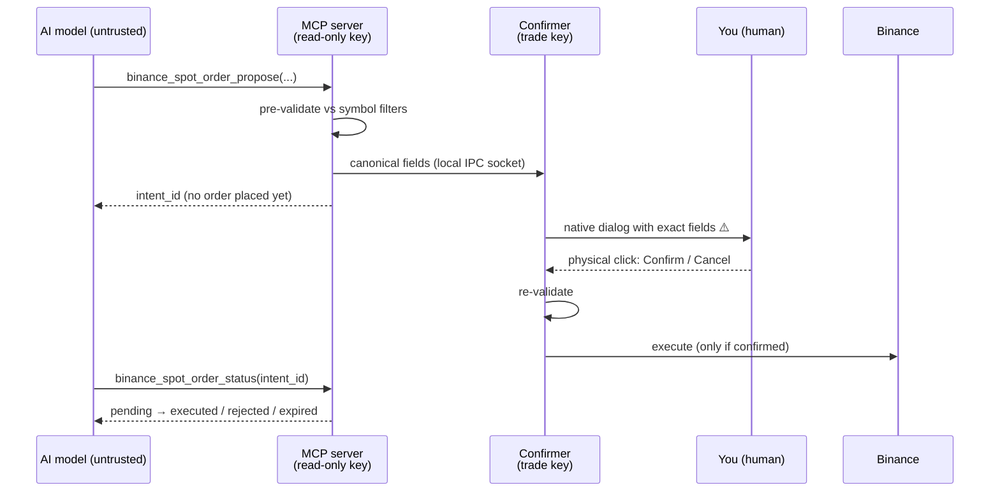

# kainext-binance-mcp

[](https://github.com/Alejandrehl/kainext-binance-mcp/actions/workflows/ci.yml)
[](LICENSE)
[](https://www.python.org/)
[](https://modelcontextprotocol.io/)
[](#development)
[](#development)
[](pyproject.toml)

> **Let an AI assistant read Binance spot markets, analyze them, and *propose* real-money
> trades — while a separate, human-gated process is the only thing that can ever execute.
> The model never holds a trade key, and nothing moves without a physical click.**

`kainext-binance-mcp` is a [Model Context Protocol](https://modelcontextprotocol.io/) server
that connects any MCP client (Claude Code, Claude Desktop, …) to a Binance **spot** account.
It exposes **18 tools** spanning live market data, technical indicators, news & sentiment,
transparent trading signals, and **two-phase order execution with a human in the loop**.

It is built around one uncompromising idea: **treat the language model as untrusted.** Even a
fully prompt-injected or malfunctioning model cannot move your funds, because it has neither
the credential nor the authority to do so. See [SECURITY.md](SECURITY.md) for the full threat
model.

> ⚠️ **Real money.** On `mainnet`, every order moves actual funds. **Always start on
> [testnet](#testnet-first-recommended)** and switch to mainnet only once everything is
> verified.
> ⚠️ **Execution currently requires macOS.** The confirmer uses `osascript` for the native
> confirmation dialog. Read/analysis tools are cross-platform; execution on other OSes is on
> the [roadmap](#roadmap).

---

## Why this exists

LLM agents are great at *reasoning about* markets and terrible at being *trusted with*
irreversible, money-moving actions. Most "AI trading" tooling hands the model an API key and
hopes for the best. This project takes the opposite stance: the AI gets rich, read-only
context and a way to **propose** an action, but a **human holds the trigger** and a
**separate process holds the key**. You get the upside of an AI co-pilot for spot trading
without surrendering custody or control.

## Security model — the headline feature

Two processes, least privilege, human-in-the-loop:

| Process | Launched by | Key | Role |
|---|---|---|---|
| **MCP server** `kainext-binance-mcp` | your MCP client (stdio) | **read-only** (`BINANCE_READ_*`) | reads, pre-validates, and **proposes** orders. **Never executes, holds no trade key.** |
| **Confirmer** `kainext-binance-mcp-confirmer` | **you**, in a separate terminal | **trade** (`BINANCE_TRADE_*`) | the **sole authority**: receives canonical fields, renders the dialog, re-validates, and **executes only on your click**. |



To execute one order you need **both** the trade key (isolated in the confirmer) **and** your
physical click. The model has neither. Defense in depth on top of that:

- On **mainnet**, the server aborts at startup if its read key can trade.
- The confirmer aborts at startup if the trade key has withdrawals/transfer/margin/futures
  permissions or no IP whitelist.
- Withdrawals and transfers are **permanently out of scope** — no key enables them.
- **Single-tenant:** one server+confirmer pair serves exactly one account; run separate pairs
  for separate accounts.

---

## Tools (18)

### Read (5 · read key · no gate)

| Tool | What it does | Params |
|---|---|---|
| `binance_get_balance` | Spot balances (free/locked), non-zero only | — |
| `binance_get_price` | Current price/ticker for a symbol | `symbol` |
| `binance_get_open_orders` | Open spot orders + status | `symbol?` |
| `binance_get_order_history` | Closed spot order history | `symbol`, `limit?` |
| `binance_get_account_info` | Flags + fees; key permissions (mainnet) | — |

### Market data — layer 2 (4 · read key · 100% read-only)

| Tool | What it does | Params |
|---|---|---|
| `binance_get_klines` | OHLCV candles (Decimal) for a pair/interval | `symbol`, `interval`, `limit?` (≤1000) |
| `binance_get_ticker_24h` | Rolling 24h stats (% change, high/low, volume) | `symbol` |
| `binance_compute_indicators` | RSI / MACD / EMA / Bollinger / ATR, aligned to candles | `symbol`, `interval`, `indicators`, `limit?` |
| `binance_backtest` | Lightweight, no-lookahead backtest of a simple rule | `symbol`, `interval`, `strategy` (`ema_cross`/`rsi_threshold`), `limit?` |

### News & sentiment — layer 3 (2 · public RSS · no API key · 100% read-only)

| Tool | What it does | Params |
|---|---|---|
| `binance_get_news` | Crypto headlines from RSS (CoinDesk, crypto.news) | `asset?`, `sources?`, `limit?` |
| `binance_get_sentiment` | Aggregated **raw** sentiment (lexicon, not a prediction) | `asset`, `window_hours?` |

### Signals — layer 4 (3 · read key · *propose*, never execute)

| Tool | What it does | Params |
|---|---|---|
| `binance_generate_signal` | Composite, transparent signal: direction + score + per-factor rationale + ATR risk levels | `symbol`, `interval?`, `threshold?` |
| `binance_scan_signals` | Signals for a watchlist, ranked by score | `symbols`, `interval?` |
| `binance_backtest_signal` | Backtest the composite technical signal (no lookahead, sentiment=0) | `symbol`, `interval?`, `limit?`, `threshold?` |

### Write — two-phase (4 · spot only · the server never executes)

| Tool | What it does | Params |
|---|---|---|
| `binance_spot_order_propose` | Proposes an order; **does not execute**. Returns `intent_id` | `symbol`, `side`, `type`, `env`, `quantity?`, `quote_quantity?`, `price?`, `time_in_force?` |
| `binance_spot_order_status` | Polls the outcome of a proposal | `intent_id` |
| `binance_cancel_order_propose` | Proposes a cancellation (re-checks state); **does not cancel** | `symbol`, `order_id`, `env` |
| `binance_cancel_order_status` | Polls the outcome of a cancellation | `intent_id` |

The read, market-data, news, and signal tools work without the confirmer. The `*_propose`
tools require the confirmer to be running.

---

## Quickstart

**Prerequisites:** Python 3.12+, [uv](https://docs.astral.sh/uv/), and (for execution) macOS.

### 1. Create the API key(s) on Binance

Go to Binance → **API Management**. The design uses two keys for least privilege:

1. **Read-only** (used by the server): `Enable Reading` **ON**; everything else **OFF**.
2. **Trade** (used by the confirmer): `Enable Spot & Margin Trading` **ON**; withdrawals,
   universal/internal transfer, margin, futures **OFF**; **IP whitelist mandatory**. The
   confirmer aborts on mainnet if any dangerous permission is on or the IP restriction is off.

> On **testnet** ([testnet.binance.vision](https://testnet.binance.vision)), a single key
> serves both roles — there are no granular permissions or IP whitelist there.

### 2. Set environment variables

| Variable | Process | Where it goes |
|---|---|---|
| `BINANCE_ENV` | both | `testnet` or `mainnet` (no default → aborts if missing/invalid) |
| `BINANCE_READ_API_KEY` / `BINANCE_READ_API_SECRET` | server | `.mcp.json` (via `${VAR}`) or the server's shell |
| `BINANCE_TRADE_API_KEY` / `BINANCE_TRADE_API_SECRET` | confirmer | **only** the shell where you launch the confirmer |

> 🔒 **Hard rule:** the **trade key never goes in `.mcp.json`** or any environment your AI
> client inherits. It lives only in the confirmer's shell.

### 3. Add the server to your MCP client

`.mcp.json` (Claude Code style). Only the read key + `BINANCE_ENV`:

```json
{
  "mcpServers": {
    "binance": {
      "command": "uvx",
      "args": ["--from", "git+ssh://git@github.com/Alejandrehl/kainext-binance-mcp", "kainext-binance-mcp"],
      "env": {
        "BINANCE_ENV": "${BINANCE_ENV}",
        "BINANCE_READ_API_KEY": "${BINANCE_READ_API_KEY}",
        "BINANCE_READ_API_SECRET": "${BINANCE_READ_API_SECRET}"
      }
    }
  }
}
```

`${VAR}` placeholders are resolved from your shell. If a variable arrives unexpanded, the
server aborts with a clear message — export the variables before launching your client.

### 4. Run the confirmer (required to execute)

In a separate terminal, with the **trade** key exported:

```bash
export BINANCE_ENV=testnet
export BINANCE_TRADE_API_KEY="...your trade key..."
export BINANCE_TRADE_API_SECRET="...your trade secret..."

uvx --from "git+ssh://git@github.com/Alejandrehl/kainext-binance-mcp" kainext-binance-mcp-confirmer
```

It listens on a local Unix socket. When the AI proposes an order, a **native dialog** appears
with the exact fields (symbol, side, type, effective quantity, price, `timeInForce`, estimated
notional, and a `TESTNET` / `⚠️ REAL MONEY` banner). The default button is **Cancel**; the
order executes only when you click **Confirm**.

### Testnet-first (recommended)

1. Generate keys at [testnet.binance.vision](https://testnet.binance.vision) (login with
   GitHub → *Generate HMAC_SHA256 Key*) and request faucet funds.
2. Export `BINANCE_ENV=testnet` and the testnet keys.
3. Exercise the full flow with fake money before touching mainnet.

## Mainnet = real money + macOS

On `mainnet`, the confirmer re-validates against live symbol filters, shows the
`⚠️ REAL MONEY` banner, and waits for your click. Start with minimal order sizes. Execution
requires macOS (the dialog uses `osascript`).

---

## Development

Requires Python 3.12+ and `uv`. See [CONTRIBUTING.md](CONTRIBUTING.md) for details.

```bash
uv venv --python 3.12
uv pip install -e ".[dev]"

uv run ruff check src/     # lint
uv run mypy                # strict type checking
uv run pytest -q           # tests + coverage (gate: 90% min; currently ~99%)
```

The unit suite runs fully offline. Integration tests (`-m integration`) hit Binance testnet
and skip cleanly without keys. CI runs lint + types + tests on every push and PR.

## Roadmap

- Headless / non-macOS confirmation (today the dialog is macOS-only via `osascript`).
- Additional order types and exchange surfaces beyond spot.
- Optional notification channels for proposal/execution events.

## Author

Built by **[Alejandro Exequiel Hernández Lara](https://github.com/Alejandrehl)** — founder of
[KaiNext](https://www.kainext.cl). Part of KaiNext's MCP product line.

## License

[MIT](LICENSE) © 2026 Alejandro Exequiel Hernández Lara (KaiNext)
